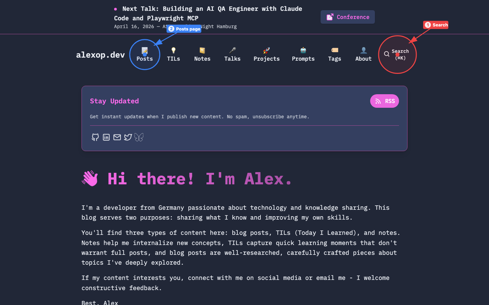
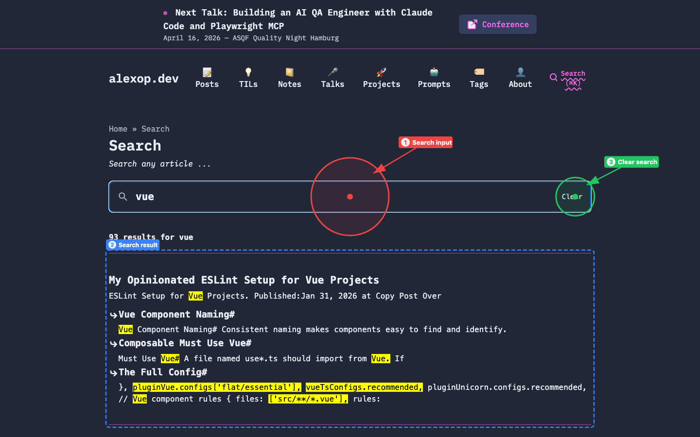
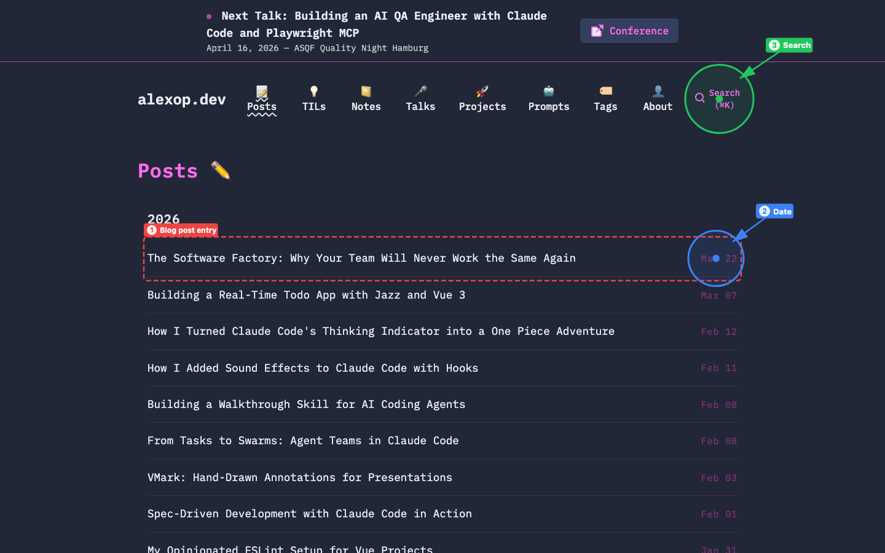

# alexop.dev - How to Search for a Blog Post

A personal dev blog by Alex, covering Vue, TypeScript, AI tooling, testing, and more.

**URL:** https://alexop.dev
**Date:** 2026-03-26

**Annotation key:** Red = primary actions, Blue = secondary elements, Green = content areas

---

## Homepage

The homepage features a top navigation bar with links to all content sections. Use the **Search** (1) icon in the top-right corner to open the search overlay. Alternatively, click **Posts** (2) in the nav to browse all blog posts chronologically.

---

## Search Results

Clicking the search icon opens a full-page search powered by Pagefind. Type your query into the **Search input** (1) to instantly filter posts. Results appear below — each **Search result** (2) shows the post title, an excerpt with highlighted matches, and metadata. Use the **Clear search** (3) button to reset and start a new query.

---

## Posts Listing

The Posts page lists all blog entries in reverse chronological order. Each **Blog post entry** (1) shows the title as a link alongside its **Date** (2). You can also use the **Search** (3) icon from this page to quickly find a specific topic instead of scrolling through the full list.

